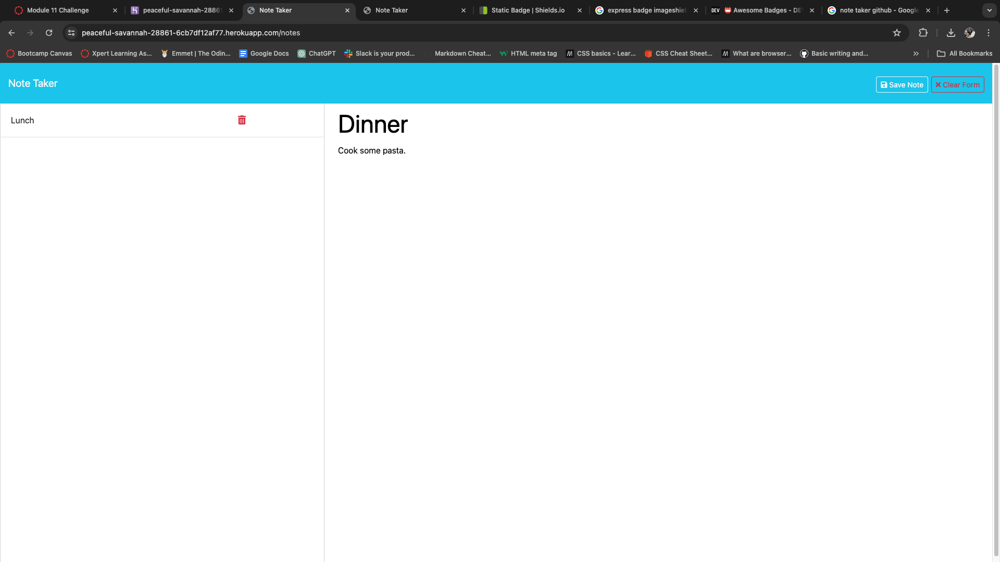
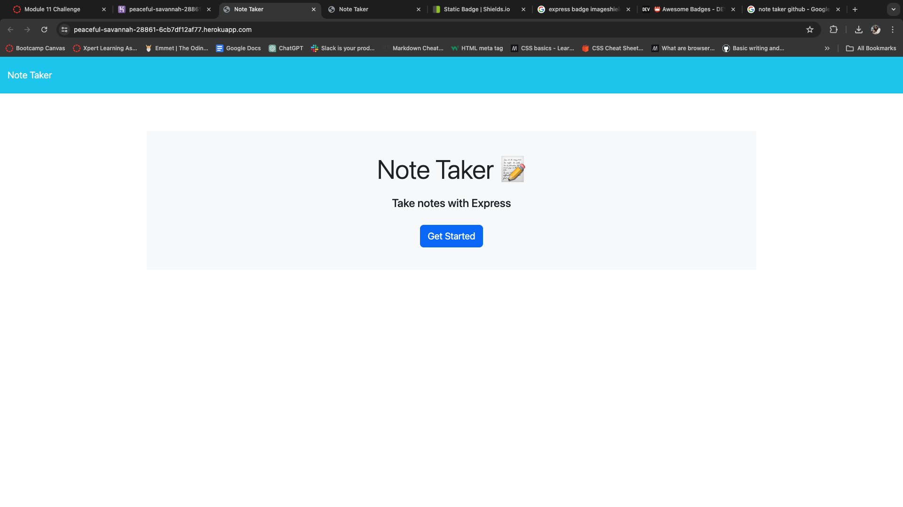

# Note Taker

[](https://expressjs.com/)
[](https://nodejs.org/en) 
[](https://www.heroku.com/)

# Description
This simple note taking application allows you to save notes with a title and plain text. Powered by ExpressJS, the Note Taker app makes creating, viewing, and deleting notes.This simple app lets you takes notes. Each note consists of a title and text.

The app uses Express.js for the back end and is hosted on Heroku. A note is an object with properties of title, text, and id. The id is generated with uuid. The db.json file acts as a database for storing and deleting notes. It is parsed and stringified each time a note is added or deleted. To view the json, visit the /api/notes endpoint.


  ## Table of Contents

* [Installation](#installation)
* [Usage](#usage)
* [Screenshots](#screenshots)
* [License](#license)
* [Contributing](#contributing)
* [Contact](#contact)

## Installation

Clone the repository to your local repository.
```
https://github.com/Jujunakarmi/Note-taker

```
Navigate to the developer-profile-generator folder using the command prompt.

Run npm install or you can use npm i as well to install all dependencies. To use the application locally, run node server.js in your CLI, and then open http://localhost:3001 in your preferred browser. The Note Taker app is live on Heroku for you to use as well.

Link for heroku:
```
https://peaceful-savannah-28861-6cb7df12af77.herokuapp.com/
```

## Usage

Click on Get Started to be taken to the app. Add a new note by typing title and notes then save by clicking on the save nore. You do also have option to clear the form. Existing notes are on the left side, click to view. Click on the red trash bin to delete a note.

## Screenshots
Here are some of the screenshots of the application.




## License
[](https://opensource.org/licenses/MIT)

## Contributing

There are no guidelines for contributing at this time. Contact me with any ideas or requests if anybody want to contribute.


## Contact
* Email: jujunakarmi@gmail.com
* LinkedIn:[https://www.linkedin.com/in/juju-nakarmi-1a79a7181/](https://www.linkedin.com/in/juju-nakarmi-1a79a7181/)